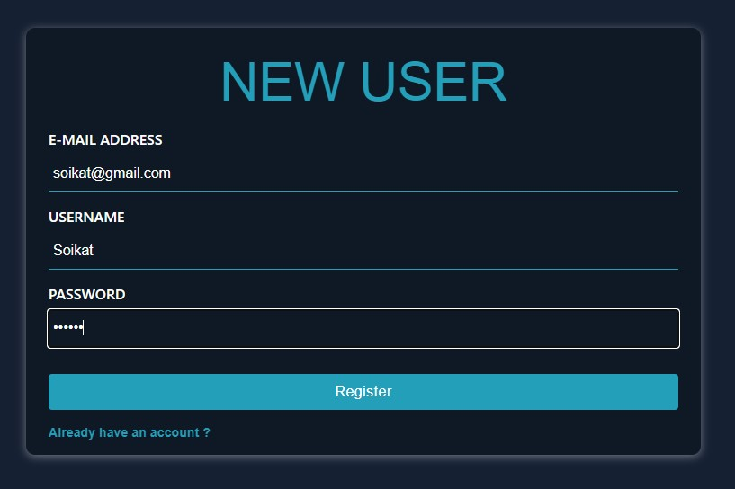
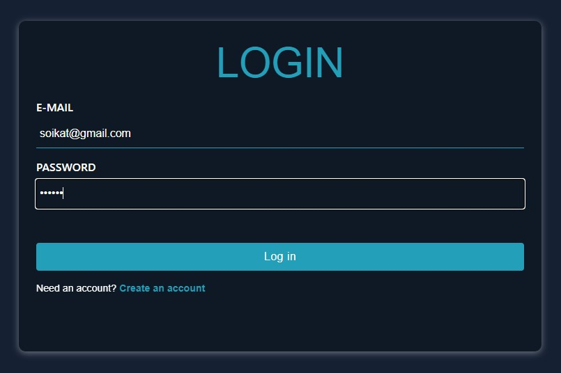
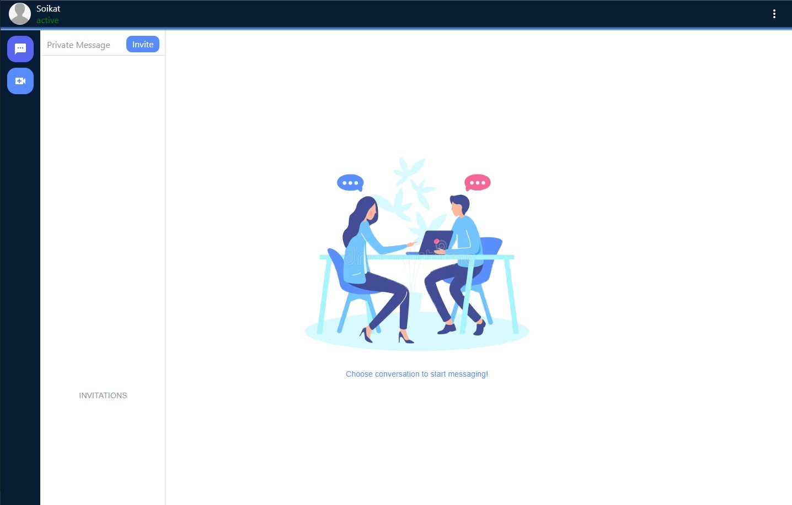
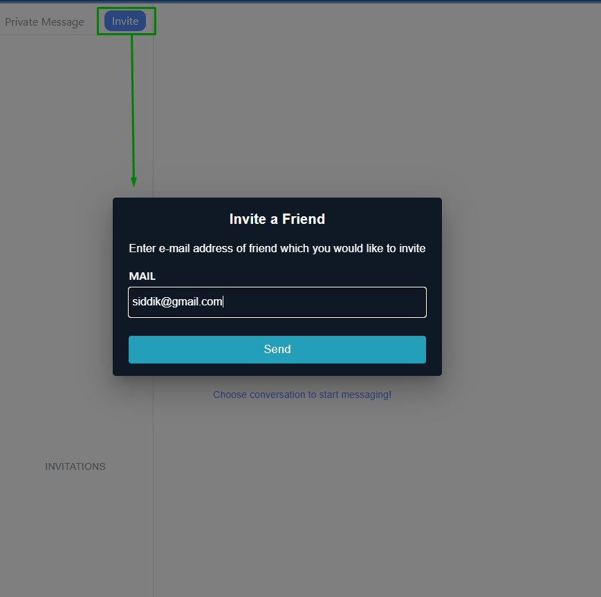
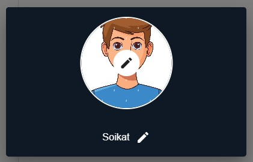
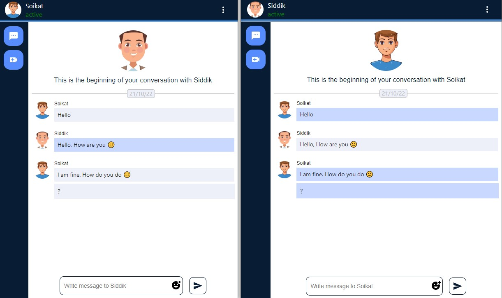
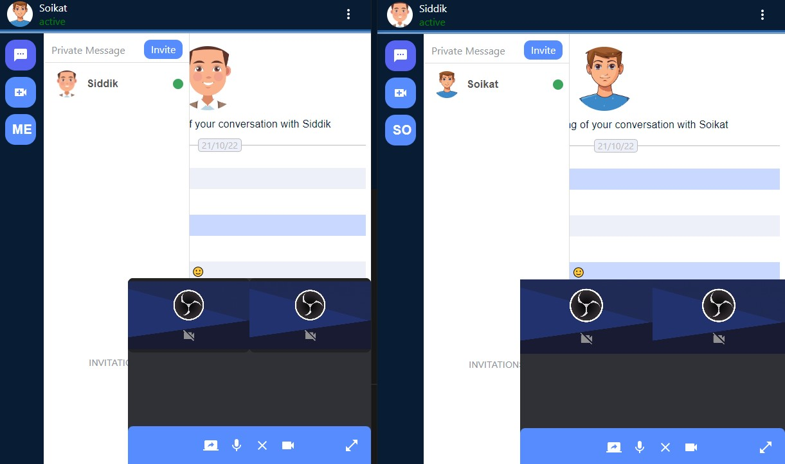

# Conversation Application

Application for helping people to communicate each other and stay connected.<br>
[Live URL](https://conversation-app.onrender.com)


## Getting Started

To get a local copy up and running follow these simple example steps.

### Prerequisites
* Nodejs ([Download and install](https://nodejs.org/en/download/))
* git ([Download and install](https://git-scm.com/downloads))

### Installation
1. Clone Repo
```
git clone https://github.com/nmsoikat/Conversation-App.git
```

2. Install NPM packages and Run
```bash
//run backend server
cd backend
npm i
npm start

//run fronted
cd frontend
npm i
npm start
```

3. backend/.env
```bash
API_PORT=
MONGODB_URI=
JWT_SECRET=
```


## Features
* [Authentication](#login)
* [Send Invitation](#invitation)
* Invitation (accept/reject)
* Friends list (online status)
* [Update profile information](#update-profile)
* [Messaging](#messaging)
* [Audio/Video Call](#video-call)
* more...


## Create new account



[Back to top](#features)

## Login



[Back to top](#features)


## Dashboard

Now, we are in dashboard page. Here we can see all friends list and invitation list.<br>
Also we can see message button and create video room button.



[Back to top](#features)


## Invitation

For sending invitation, we need to click on invite button. Invitation sending modal will open. <br>
Now, we will provide email of another user and click on send button



[Back to top](#features)


## Update Profile

In dashboard page top left corner we have profile section. For changing any information we need to click on profile image



[Back to top](#features)


## Messaging

We need to choose one friend to start conversation. Just click on any of friends from friend list and start messaging



[Back to top](#features)


## Video call

We can see video button on left side bar. We need to click on this button.<br>
Meeting room will create. Now, our friends will see the meeting and join



[Back to top](#features)


## Built With

* [HTML](https://www.w3schools.com/html/)
* [CSS](https://www.w3schools.com/css/)
* [MUI](https://mui.com/)
* [React](https://reactjs.org/)
* [Redux](https://redux.js.org/)
* [Nodejs](https://nodejs.org/en/)
* [Express](https://expressjs.com/)
* [Mongodb](https://www.mongodb.com/)
* [Mongoose](https://mongoosejs.com/)
* [Socket.io](https://socket.io/)
* [WebRTC](https://webrtc.org/)


## Contact
Nur Mohammad Soikat - 
[Linkedin](https://www.linkedin.com/in/nmsoikat/)

[Back to top](#features)